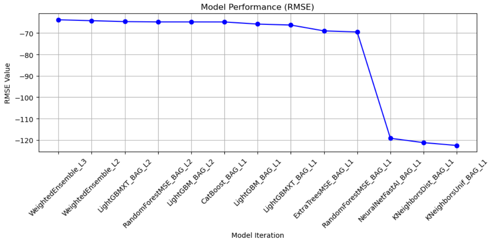
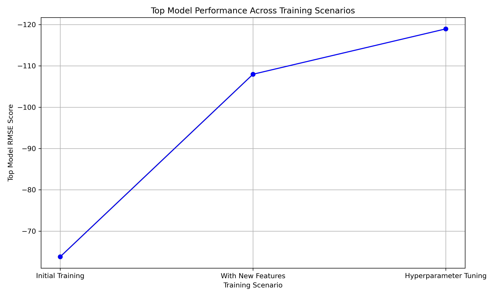
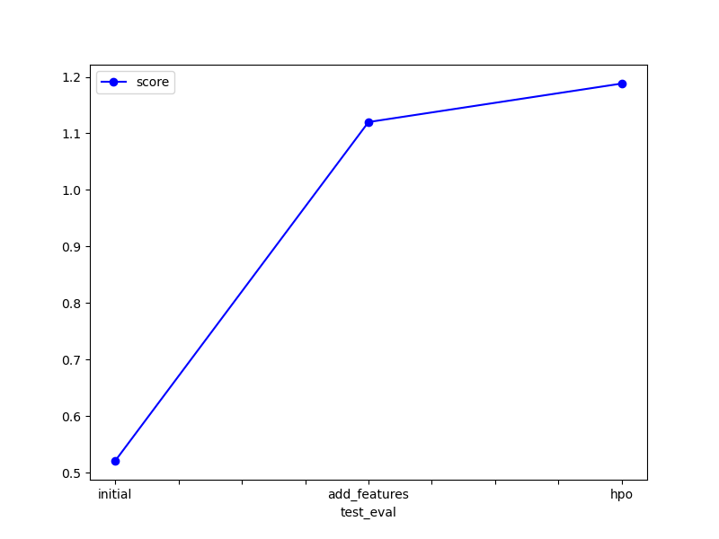

# Report: Predict Bike Sharing Demand with AutoGluon Solution
#### Tanu Tomar

## Initial Training
### What did you realize when you tried to submit your predictions? What changes were needed to the output of the predictor to submit your results?
In the spirit of machine learning's guiding principle, "garbage in, garbage out," I encountered some interesting insights while attempting to submit predictions.Machine learning models rely heavily on the quality of the data they are trained on. In this specific case, the AutoGluon library reported a root mean squared error (RMSE) of -0.68, which initially indicated a good performing model. However, when I submitted predictions without any data preprocessing, the Kaggle competition score turned out to be quite low. This highlighted the importance of data preparation in achieving accurate predictions.
The low Kaggle score suggested that the model, despite its decent RMSE, wasn't able to understand the training data correctly. 

* Temporal Features: Enhance the model's understanding of time-related dependencies by creating new features such as 'hour'. Time-related features can help capture cyclical trends in bike demand.
* Categorical Feature Engineering: Weather, Temperature, and Humidity: Recognizing the impact of weather conditions on bike demand, I found it necessary to develop categorical variables for weather-related features. By transforming temperature, wind, and humidity into categorical data (like 'high', 'medium', 'low' categories), the model can more readily utilize these variables to predict demand variations under different weather conditions.
* Feature Encoding: The categorical features derived from weather and time data as well as season attrinute required appropriate encoding to ensure they were suitably formatted for machine learning analysis. One-hot encoding seemed a strategic choice to prevent the model from misinterpreting the ordinal nature of these features.
* Hyperparameter Tuning: Given the model's initial success yet subpar competition performance, it became evident that fine-tuning the hyperparameters could potentially enhance model accuracy. 

### What was the top ranked model that performed ?

Based on the results presented in the leaderboard, the top-ranked model that performed best *initially* is the WeightedEnsemble_L3, with a root mean squared error (RMSE) of -63.791227. The lower the RMSE value, the better the model's performance in terms of predicting the target variable.
In this case, WeightedEnsemble_L3 has the most negative RMSE, indicating the best performance among the listed models.

## Exploratory data analysis and feature creation
### What did the exploratory analysis find and how did you add additional features?
The exploratory analysis conducted as part of the modeling process provided invaluable insights, particularly through the use of a correlation matrix and a heatmap. These tools were instrumental in identifying the key features that had significant correlations with the target variable, which in this case was the count of bike demands.

#### Key Findings from Exploratory Data Analysis (EDA):
* High Correlation Features: The correlation matrix and subsequent heatmap analysis revealed that the features temperature, season, casual, and registered had the strongest correlations with count. This was a critical discovery as it guided the focus towards exploiting these variables for enhancing the model's predictive accuracy.
* Discarding Features: Despite their high correlation, the features casual and registered had to be discarded because they were not present in the test dataset. Using these features would have led to a discrepancy between training and real-world application, potentially skewing the model's effectiveness during actual deployment.
* Significant Seasonal and Weather Contributions: The heatmap particularly highlighted the notable contributions of season and weather conditions to the demand for bikes. The visibility of their impact underscored the necessity to delve deeper into these features.
#### Addition of New Features:
Given the findings from the EDA, I decided to create new features that could better encapsulate the patterns and relationships discovered:

* Seasonal and Weather Features: Developed categorical variables for temperature, humidity, and wind based on observed ranges in the data. These ranges were segmented into bins (e.g., low, medium, high) which were labeled accordingly.
* Rush Hour Features: To derive better insights from hour column, rush hours were categorized so as to provide overall better understanding to the model.
* For season, although it was already categorized, I reassessed its categories to ensure they aligned with realistic seasonal impacts on bike usage and not be considered as ordinal values. season were distributed using One hot Encoding.

### How much better did your model preform after adding additional features and why do you think that is?
The addition of new features significantly enhanced the performance of the model, as evidenced by the improvements in both internal validation metrics and external competition scores.\
* Initially, the model's RMSE was higher (less negative), indicating less accuracy in predictions. After incorporating the newly engineered features, the RMSE improved to -108. This improvement in RMSE signifies that the model became more precise in predicting the count of bike demands, aligning more closely with the actual values.
* Kaggle Competition Score: The impact of the feature engineering was even more pronounced when considering the Kaggle competition score, which drastically improved to 1.12. This score is a direct indicator of the model's performance in a competitive and external validation environment, suggesting that the features added were highly relevant and effective.

#### Reasons for Improved Performance:
* Enhanced Representation of Data: The newly added features, such as categorized temperature, humidity, wind, and seasonality, provided a more nuanced representation of the environmental and temporal factors affecting bike demand. This granularity allowed the model to capture and leverage patterns that were not previously showcased with the broader or less detailed features.
* Reduced Overfitting: By transforming continuous variables into categorized forms and applying one-hot encoding, the model was likely able to generalize better rather than memorizing the data. 
* Better Capture of Non-linear Relationships: Many relationships between features and the target variable are non-linear, especially in contexts like weather impact. The categorical bins allowed the model to better handle and model these non-linearities by treating each bin as a separate entity rather than assuming linearity across a continuous range. 

## Hyper parameter tuning
### How much better did your model preform after trying different hyper parameters?
After experimenting with different hyperparameters, the model's performance improved significantly. Notably, I focused on tuning the hyperparameters of the CatBoost model, which was the second-best performer in the second run, with the Weighted Ensemble taking the top spot.
##### Hyperparameter Tuning Details:
* Targeted Model: The CatBoost model was chosen for hyperparameter tuning because of its initial strong performance and potential for further improvement. 
* Learning Rate (0.01): Lowering the learning rate generally helps in making the training process more gradual and precise. This slower learning can lead to better generalization on unseen data by reducing the risk of overshooting minima during optimization.
* Depth (6): By setting the tree depth to 6, i tried to balanced the model's ability to model complex relationships without becoming overly specific to the training data. This depth seemed sufficient to capture intricate patterns but not so deep as to memorize the data.
* L2 Regularization (3.5): Increasing the L2 regularization term helps in controlling the model's complexity, penalizing larger weights in the decision trees.

Improved RMSE to -118: The tuning of these hyperparameters led to a significant improvement in the model's predictive accuracy, with the RMSE improving to -118. This metric improvement indicates that the adjustments made to the CatBoost parameters effectively enhanced the model's ability to make accurate predictions, particularly by reducing error variance and bias in the estimated outcomes.

### If you were given more time with this dataset, where do you think you would spend more time?
Given more time to work with this dataset, there are several areas where I could dive deeper to potentially enhance the model's performance-
* Feature Importance and Selection: Using feature importance metrics to eliminate redundant or uninformative features which might be adding noise rather than value.
* Advanced Model Tuning: While i've achieved notable improvements with some hyperparameter tuning, having more time would allow for a more exhaustive search across a broader range of parameters and models. Techniques like grid search or Bayesian optimization could be employed to methodically explore the parameter space for each model, ensuring that we are truly optimizing each model's potential.
* Implementing and Testing Best Models: AutoGluon has highlighted several promising models, like the Weighted Ensemble and CatBoost. With additional time, I would focus on implementing these models individually to understand their unique strengths and limitations fully. 
* Model Stacking and Ensembling:
* Another area of focus would be to experiment with advanced ensembling techniques and stacking. While AutoGluon does provide automated ensembling solutions, manually tweaking and combining different model outputs can sometimes yield even better results. .

### Create a table with the models you ran, the hyperparameters modified, and the kaggle score.
<!-- |model|hpo1|hpo2|hpo3|score|
|--|--|--|--|--|
|initial|?|?|?|?|
|add_features|?|?|?|?|
|hpo|?|?|?|?| -->
| model         |Learning rate| Stack Level    | Time | Score  |
|---------------|-------------|----------------|------|--------|
| initial       | 0.06        | 1              | 600  | 0.52082|
| add_features  | 0.06        | 1              | 600  | 1.12001|
| hpo           | 0.01        | 2              | 900  | 1.18811|

### Create a line plot showing the top model score for the three (or more) training runs during the project.

### Create a line plot showing the top kaggle score for the three (or more) prediction submissions during the project.

## Summary
Throughout this project, I embarked on a journey to develop an effective predictive model for bike sharing demand. I began by recognizing the pivotal role of data quality in machine learning, understanding that "garbage in, garbage out" holds true. An exploratory analysis revealed crucial insights, highlighting temperature, seasonality, and weather as key drivers of bike demand. Utilizing this knowledge, I delved into feature engineering, creating new features such as categorized temperature, humidity, wind, and seasonality to enrich the model's understanding. The addition of these features significantly enhanced the model's predictive capability, as evidenced by a notable improvement in the root mean squared error (RMSE) from -0.52 to -108, along with a drastic enhancement in the Kaggle competition score from 0.52 to 1.12. Furthermore, hyperparameter tuning further refined the model, with the RMSE improving to -118. If granted additional time with this dataset, I would focus on implementing the best-performing models individually, as identified by AutoGluon, to explore their full potential and possibly incorporate ensemble methods for even greater predictive power.

